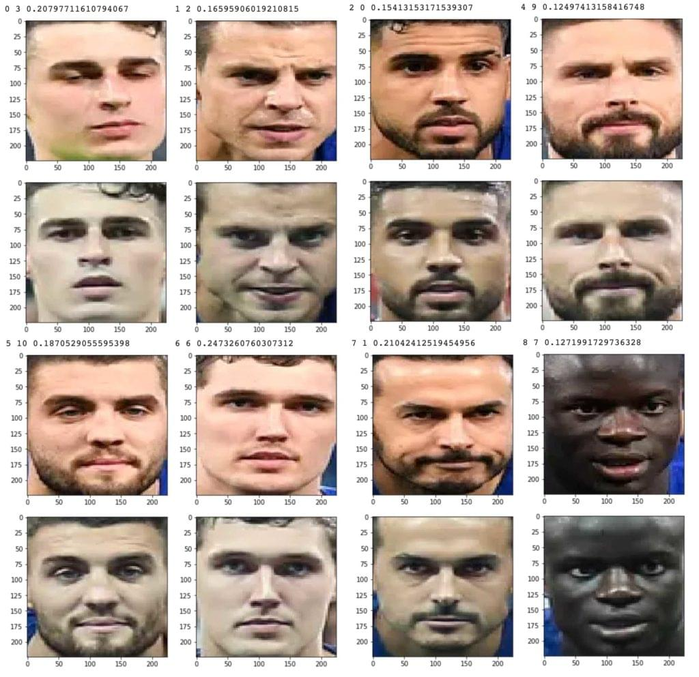

# Introduction
- How "Facebook friend tag feature" work? or How Google Photos app 's "person tag feature" work?
- 顔認証の仕組み一部理解したい

# Prerequisites
- matplotlib
    - 写真（画像）を分析するため、画像のデータを読み込むが必要
    - cv2 or matplotlibライブラリを使って画像データをロードする
    ```
    pip install matplotlib
    ```
- keras
    - implementation of a CNN algorithm
    ```
    pip install keras
    ```
- MTCNN([Multi-Task Convoluted Neural Networks](https://arxiv.org/abs/1604.02878))
    - 顔認識できるライブラリ（他もありOpenCVなど）
    ```
    pip install mtcnn
    ```
- [VGGFace2 algorithm](http://www.robots.ox.ac.uk/~vgg/software/vgg_face/)
    - 顔を比較するため、VGGFace2 algorithmを利用する
    ```
    pip install keras_vggface
    ```

# Step 1: Face Detection with the MTCNN Model
- 写真の画像を準備
- read images through matplotlib‘s imread() function
- detect and explore faces through the MTCNN algorithm
- extract faces from an image

### 1.1 ex: store external image
```
import urllib.request

def store_image(url, local_file_name):
  with urllib.request.urlopen(url) as resource:
    with open(local_file_name, 'wb') as f:
      f.write(resource.read())
```
```
store_image('https://ichef.bbci.co.uk/news/320/cpsprodpb/5944/production/_107725822_55fd57ad-c509-4335-a7d2-bcc86e32be72.jpg',
            'iacocca_1.jpg')
store_image('https://www.gannett-cdn.com/presto/2019/07/03/PDTN/205798e7-9555-4245-99e1-fd300c50ce85-AP_080910055617.jpg?width=540&height=&fit=bounds&auto=webp',
            'iacocca_2.jpg')
```

### 1.2 detect faces in an image
- imports — matplotlib for reading images, and mtcnn for detecting faces within the images:

```
from matplotlib import pyplot as plt
from mtcnn.mtcnn import MTCNN
```

- Use the imread() function to read an image:
```
image = plt.imread('iacocca_1.jpg')
```
- initialize an MTCNN() object into the detector variable and use the .detect_faces() method to detect the faces in an image.

```
detector = MTCNN()

faces = detector.detect_faces(image)
for face in faces:
    print(face)
```
```
{'box': [160, 40, 35, 44], 'confidence': 0.9999798536300659, 'keypoints': {'left_eye': (172, 57), 'right_eye': (188, 57), 'nose': (182, 64), 'mouth_left': (173, 73), 'mouth_right': (187, 73)}}
```

### 1.3 Highlight Faces in an Image
- 四角（ボックス）でハイライトしたい, import the Rectangle object from matplotlib.patches
```
from matplotlib.patches import Rectangle
```
- 画像をロード、顔を認識、ハイライト
```
def highlight_faces(image_path, faces):
  # display image
    image = plt.imread(image_path)
    plt.imshow(image)

    ax = plt.gca()

    # for each face, draw a rectangle based on coordinates
    for face in faces:
        x, y, width, height = face['box']
        face_border = Rectangle((x, y), width, height,
                          fill=False, color='red')
        ax.add_patch(face_border)
    plt.show()
 ```
 ```
 highlight_faces('images/iacocca_1.jpg', faces)
 ```
 
- 2枚目画像
```
image = plt.imread('iacocca_2.jpg')
faces = detector.detect_faces(image)

highlight_faces('iacocca_2.jpg', faces)
```

### 1.4 Extract Face for Further Analysis
- VGGFace2 algorithm needs the faces to be resized to 224 x 224 pixels
```
from numpy import asarray
from PIL import Image

def extract_face_from_image(image_path, required_size=(224, 224)):
  # load image and detect faces
    image = plt.imread(image_path)
    detector = MTCNN()
    faces = detector.detect_faces(image)

    face_images = []

    for face in faces:
        # extract the bounding box from the requested face
        x1, y1, width, height = face['box']
        x2, y2 = x1 + width, y1 + height

        # extract the face
        face_boundary = image[y1:y2, x1:x2]

        # resize pixels to the model size
        face_image = Image.fromarray(face_boundary)
        face_image = face_image.resize(required_size)
        face_array = asarray(face_image)
        face_images.append(face_array)

    return face_images

extracted_face = extract_face_from_image('iacocca_1.jpg')

# Display the first face from the extracted faces
plt.imshow(extracted_face[0])
plt.show()
```

# Step 2: Face Recognition with VGGFace2 Model
### 2.1 Compares two faces
- use VGGFace to prepare the extracted faces to be used in the face recognition models
- use cosine function from SciPy to compute the distance between two faces
```
from keras_vggface.utils import preprocess_input
from keras_vggface.vggface import VGGFace
from scipy.spatial.distance import cosine
```
- define a function that takes the extracted faces as inputs and returns the computed model scores. 
- the model returns a vector, which represents the features of a face
```
def get_model_scores(faces):
    samples = asarray(faces, 'float32')

    # prepare the data for the model
    samples = preprocess_input(samples, version=2)

    # create a vggface model object
    model = VGGFace(model='resnet50',
      include_top=False,
      input_shape=(224, 224, 3),
      pooling='avg')

    # perform prediction
    return model.predict(samples.reshape(len(faces), 224, 224, 3)

faces = [extract_face_from_image(image_path)
         for image_path in ['iacocca_1.jpg', 'iacocca_2.jpg']]

model_scores = get_model_scores(faces)
```

- use a [Euclidean or Cosine](https://cmry.github.io/notes/euclidean-v-cosine) function to calculate the similarity.
- thresold(閾値: シキイチ)は、小さいほど良い。例で0.4を使ってみる
```
if cosine(model_scores[0], model_scores[1]) <= 0.5:
  print("Faces Matched")
else :
  print("Faces not matched")
```

# 宿題
- multiple face を認識してみる
- 例：  
Chelsea Football Club:  
Europa League match vs Slavia Prague in the 2018–19 season
:format(webp)/cdn.vox-cdn.com/uploads/chorus_image/image/63613936/1143553317.jpg.5.jpg)
  vs UEFA Super Cup match vs Liverpool in the 2019–20 season  
:format(webp)/cdn.vox-cdn.com/uploads/chorus_image/image/65171515/1161847141.jpg.0.jpg)

- 結果のイメージ  


--------
[1][VGGFace2 algorithm](http://www.robots.ox.ac.uk/~vgg/software/vgg_face/)  
[2][Keras-VGGFace](https://github.com/rcmalli/keras-vggface)  
[3][MTCNN](https://github.com/ipazc/mtcnn)  
[4][Numpy and Scipy Documentation](https://docs.scipy.org/doc/)  
