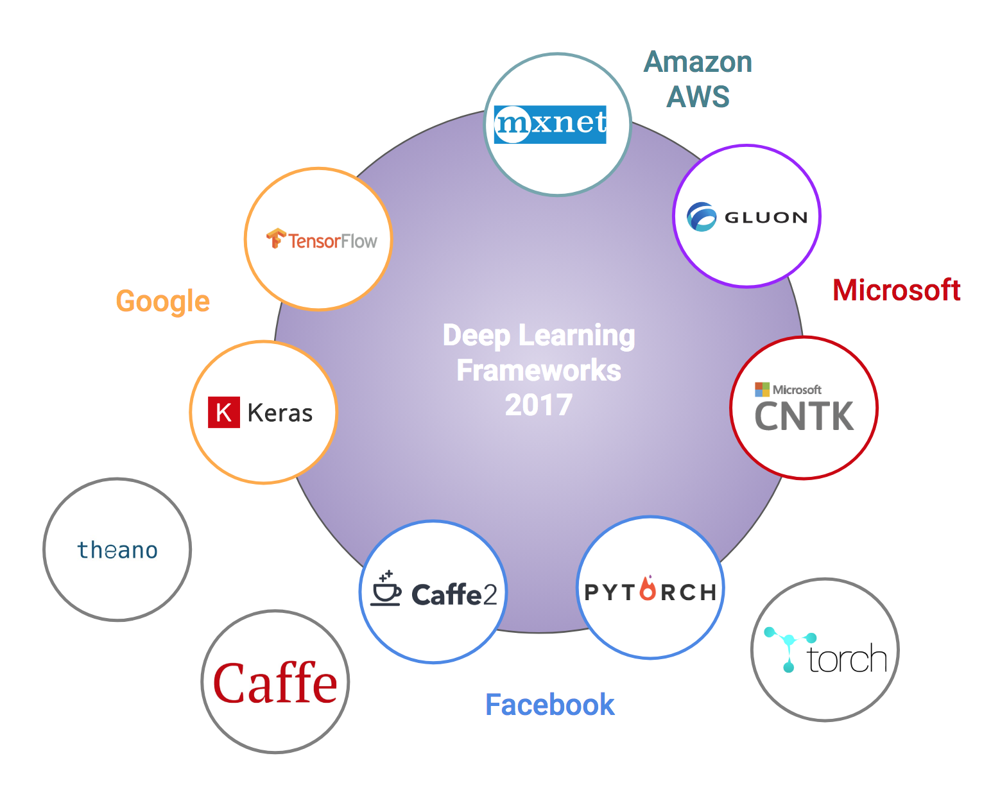
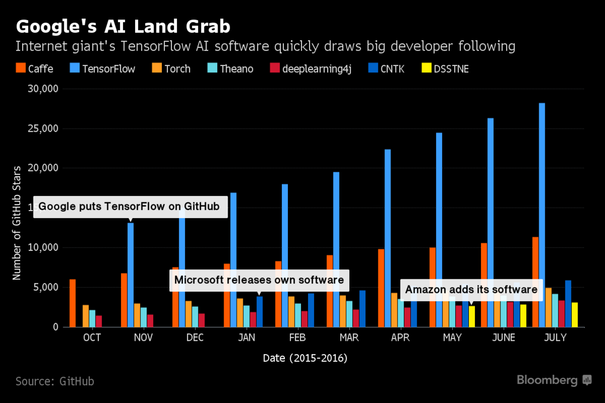
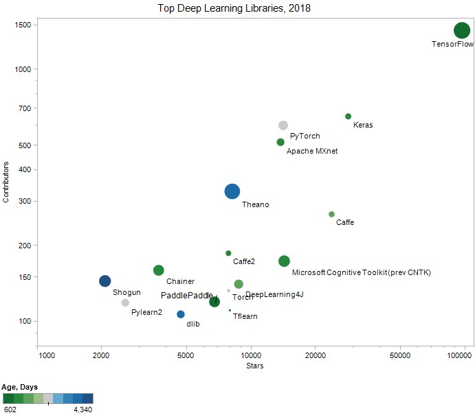

# Introduction
* Google - Keras, TensorFlow
* Facebook - Caffe2, Pytorch 
* Microsoft - CNTK
* Amazon - Mxnet
* Microsoft & Amazon - Gluon (same as Keras)

  
(source - [Battle of the Deep Learning frameworks — Part I: 2017, even more frameworks and interfaces](https://towardsdatascience.com/battle-of-the-deep-learning-frameworks-part-i-cff0e3841750))

# What is the best framework? (どれがいいのか？)
* OS, 言語
* 目的：研究 or 製品?
* Hardware(GPU?)

## 選択基準
* **GPUサポートあり**
* **分散システムのサポートあり**
* 多言語サポート: C/C++, Python, Java, R, ...
* 多OSサポート
* アイデア 〜 構築、モデルトレーニングの時間が少ない
* **開発者がモデルに修正や複雑なモデルを構成できる**
* 標準なモデルをサポートする
* auto backpropagationをサポート
* **Communityあり**

### Github starsの集計- 2015,2016

(source - [Machine Learning Frameworks Comparison](https://blog.paperspace.com/which-ml-framework-should-i-use/))  

1. TensorFlow, 2. Caffe (2015-2016)

### Github's stars, contibutors, age of library 
  
(source - [Top 16 Open Source Deep Learning Libraries and Platforms](https://blog.paperspace.com/which-ml-framework-should-i-use/))  
1. TensorFlow, 2. Keras, 3. Caffe

# Kerasおすすめ
- [Why use Keras?](https://keras.io/why-use-keras/)
- High-level, with low-level(backend): Tensorflow, CNTK, Theano(もうサポートしない)
- syntaxシンプル, 開発者のUXが優先してくれる
- 企業や研究者が使用するは多い
- GPU, Distribution sysytem サポート
- 多backend enginesサポート

